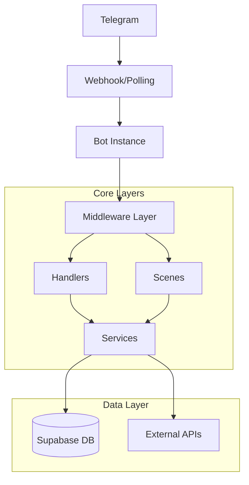

# 🏗️ Архитектура FreelanceBot

## 📊 Общая архитектура

FreelanceBot построен на модульной архитектуре, обеспечивающей четкое разделение ответственности между компонентами системы.



## 🔧 Основные компоненты

### 1. **Telegram Bot Layer** (`src/bot/`)

#### 📋 Конфигурация (`src/bot/config/`)
- **`botConfig.js`** - Настройки бота, команды, обработка ошибок
- **`navigationConfig.js`** - Маршрутизация и навигация
- **`actionHandlers.js`** - Группировка обработчиков действий

#### 🎮 Обработчики (`src/bot/handlers/`)
- **`start.js`** - Приветствие и главное меню
- **`subscription.js`** - Управление подписками на категории
- **`payment.js`** - Обработка платежей
- **`referral.js`** - Реферальная система и промокоды
- **`admin.js`** - Административные функции
- **`profile.js`** - Личный кабинет пользователя
- **`settings.js`** - Настройки и экспорт данных

#### ⚡ Middleware (`src/bot/middleware/`)
- **`auth.js`** - Аутентификация и регистрация пользователей
- **`subscription.js`** - Проверка активных подписок

#### 🎭 Сцены (`src/bot/scenes/`)
- **`subscription.js`** - Диалог выбора тарифа
- **`payment.js`** - Процесс оплаты
- **`promoCode.js`** - Создание промокодов
- **`promoRequest.js`** - Запрос промокодов

#### ⌨️ Клавиатуры (`src/bot/keyboards/`)
- **`main.js`** - Основное меню
- **`categories.js`** - Категории заказов
- **`subscription.js`** - Управление подписками
- **`admin.js`** - Админ панель

### 2. **Business Logic Layer** (`src/services/`)

#### 📡 Основные сервисы:
- **`notificationService.js`** - Отправка уведомлений
- **`databaseService.js`** - Работа с базой данных
- **`jobParser.js`** - Парсинг заказов из каналов
- **`messageFormatter.js`** - Форматирование сообщений
- **`scheduler.js`** - Планировщик задач
- **`telegramParser.js`** - Парсинг Telegram сообщений

### 3. **Data Layer** (`src/database/`)

#### 📂 Модели (`src/database/models/`)
- **`User.js`** - Модель пользователя
- **`Category.js`** - Модель категории
- **`Subscription.js`** - Модель подписки
- **`ParsingChannel.js`** - Модель канала для парсинга
- **`Referral.js`** - Модель реферальной системы

#### 🔄 Миграции (`src/database/migrations/`)
- Автоматические миграции базы данных
- Версионирование схемы

### 4. **Server Layer** (`src/server/`)

- **`expressServer.js`** - HTTP сервер для webhook и API
- Endpoint'ы для здоровья системы
- Обработка webhook'ов от Telegram

## 🗄️ Структура базы данных

### Основные таблицы:

```sql
-- Пользователи
users (
  id: uuid PRIMARY KEY,
  telegram_id: bigint UNIQUE,
  username: text,
  first_name: text,
  created_at: timestamp,
  subscription_end: timestamp,
  trial_used: boolean,
  role: user_role DEFAULT 'user'
)

-- Категории заказов
categories (
  id: uuid PRIMARY KEY,
  name: text UNIQUE,
  keywords: text[],
  enabled: boolean DEFAULT true,
  created_at: timestamp
)

-- Подписки пользователей
subscriptions (
  id: uuid PRIMARY KEY,
  user_id: uuid REFERENCES users,
  category_id: uuid REFERENCES categories,
  created_at: timestamp
)

-- Каналы для парсинга
parsing_channels (
  id: uuid PRIMARY KEY,
  channel_id: bigint UNIQUE,
  channel_name: text,
  enabled: boolean DEFAULT true,
  last_message_id: bigint,
  created_at: timestamp
)

-- Реферальная система
referrals (
  id: uuid PRIMARY KEY,
  referrer_id: uuid REFERENCES users,
  referred_id: uuid REFERENCES users,
  created_at: timestamp,
  bonus_paid: boolean DEFAULT false
)

-- Промокоды
promo_codes (
  id: uuid PRIMARY KEY,
  code: text UNIQUE,
  creator_id: uuid REFERENCES users,
  bonus_days: integer DEFAULT 0,
  discount_percent: integer DEFAULT 0,
  usage_count: integer DEFAULT 0,
  usage_limit: integer,
  created_at: timestamp,
  expires_at: timestamp
)
```

## 🔐 Система безопасности

### Row Level Security (RLS)

```sql
-- Пример политики RLS для пользователей
CREATE POLICY "Users can view own data"
  ON users FOR SELECT
  USING (telegram_id = get_current_user_telegram_id());

-- Политика для админов
CREATE POLICY "Admins can view all data"
  ON users FOR ALL
  USING (is_admin(get_current_user_telegram_id()));
```

### Роли и права доступа:

- **`user`** - Обычный пользователь
- **`admin`** - Администратор системы
- **`super_admin`** - Суперадминистратор

## 📈 Поток данных

### 1. Парсинг заказов:
```
Telegram Channel → Parser → Database → Notification Service → Users
```

### 2. Обработка команд пользователя:
```
User Input → Middleware → Handler → Service → Database → Response
```

### 3. Система подписок:
```
User → Category Selection → Database → Scheduler → Notifications
```

## 🔄 Lifecycle Events

### Запуск приложения:
1. Инициализация Express сервера
2. Создание экземпляра бота
3. Настройка middleware и обработчиков
4. Подключение к базе данных
5. Запуск планировщика
6. Установка webhook (production) или polling (development)

### Обработка сообщения:
1. Получение update от Telegram
2. Аутентификация пользователя (middleware)
3. Маршрутизация к соответствующему обработчику
4. Выполнение бизнес-логики
5. Обновление базы данных
6. Отправка ответа пользователю

## 🚀 Масштабирование

### Горизонтальное масштабирование:
- Использование webhook для множественных инстансов
- Разделение парсера и бота на отдельные сервисы
- Кэширование частых запросов

### Вертикальное масштабирование:
- Оптимизация запросов к базе данных
- Асинхронная обработка уведомлений
- Batch-обработка сообщений

## 📊 Мониторинг

### Метрики:
- Количество активных пользователей
- Скорость обработки сообщений
- Успешность доставки уведомлений
- Использование ресурсов сервера

### Логирование:
- Структурированные логи всех операций
- Отслеживание ошибок и исключений
- Аудит административных действий 